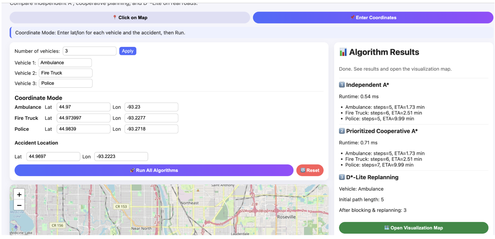
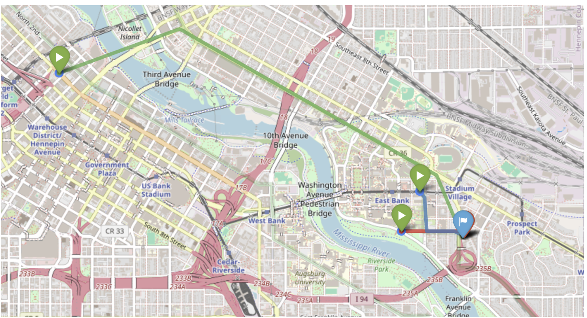

# Coordinated Path Planning for Emergency Vehicles using Multi-Agent Pathfinding

When a major accident occurs in a city, multiple emergency vehicles such as ambulances, police cars, and fire engines must reach the accident location as quickly as possible. The response time of these vehicles can be critical in saving lives.

Urban road networks are complex and constantly changing due to traffic congestion, one-way roads, and unexpected blockages. If each emergency vehicle performs route planning independently, they may obstruct each other at intersections or choose inefficient routes.

This project develops a **Multi-Agent Path Finding (MAPF)** approach using AI techniques to compute **time-optimal and collision-free coordinated routes** for multiple emergency vehicles heading toward the same accident location.

The work explores how traditional search and planning techniques can be extended to multi-agent pathfinding in a simulated urban environment.

---

# Related Work

This project builds upon several established AI planning techniques:

- **A\*** heuristic search using Haversine distance as described in *Artificial Intelligence: A Modern Approach* by Russell and Norvig.
- **Cooperative Pathfinding (CA\*)** proposed by David Silver, using a **Reservation Table (Space-Time Map)** to coordinate agents.
- **Conflict-Based Search (CBS)** proposed by Sharon et al. for optimal multi-agent pathfinding.
- **D\* Lite** by Koenig and Likhachev for efficient dynamic replanning when edge costs change.

The project also uses **OpenRouteService (ORS)** to obtain realistic road network data and route geometry.

---

# Software Requirements

The system uses the following software stack:

- **Language:** Python 3.11+
- **Graph Processing:** networkx
- **Numerical Operations:** numpy
- **Web Framework:** flask
- **Map Data:** openrouteservice API
- **Visualization:** folium (Leaflet.js wrapper)

---

# Approach

The city road network is modeled as a graph:

- **Nodes:** intersections  
- **Edges:** road segments

Each emergency vehicle acts as an agent trying to reach the accident location.

---

## Algorithms Implemented

### 1. Independent A\*
A standard A* search is executed independently for each vehicle.

- Fast computation
- Ignores other agents
- Used as a baseline for comparison
- Can lead to collisions between vehicles

---

### 2. Prioritized Cooperative A\*

Agents are assigned strict priority levels:

Ambulance > Fire Truck > Police

Process:

1. The highest priority agent plans its path using standard A*.
2. The path is stored in a **Space-Time Reservation Table**.
3. Lower priority agents plan in a **3D state space (node, time)**.
4. Nodes occupied at time `t` are treated as obstacles for other agents.

This ensures collision-free routing.

---

### 3. D\* Lite (Dynamic Replanning)

D* Lite handles **dynamic changes such as road closures**.

- Searches backward from goal to start
- Maintains consistency values for nodes
- When an edge cost changes, only inconsistent nodes are reprocessed

This significantly reduces runtime compared to replanning from scratch.

---

## Rationale for Dropping Conflict-Based Search (CBS)

CBS was initially considered but replaced by prioritized planning due to:

### 1. Exponential Complexity
CBS uses a two-level search structure:

- High-Level Constraint Tree
- Low-Level A* search

In dense city graphs, the constraint tree grew exponentially and required over an hour to produce results.

### 2. Practical Priority Structure
In real emergency situations, a strict hierarchy exists where certain vehicles must move first (e.g., ambulances). This makes prioritized planning a faster and more practical solution.

---

## Reasonableness of the Solution

- A* is efficient for single-agent shortest path problems.
- Reservation-based coordination scales well.
- Dynamic replanning is necessary for real-world emergency response.
- The solution balances **algorithmic complexity, practicality, and efficiency**.

---

# Instructions to Run the Project

### 1. Unzip the Project

Extract the project folder.

---

### 2. Install Dependencies

Inside the project directory:
pip install -r requirements.txt

If errors occur, run using a virtual environment.

---

### 3. Configure API Key

Set the OpenRouteService API key in the terminal.

export ORS_API_KEY="YOUR_API_KEY"

---

### 4. Run the Server
`python app.py`

Initial startup may take time because the `pycache` folder is included.

---

### 5. Open the Application

Open the browser and go to:
http://localhost:5500

---

### 6. Run the Simulation

- Select vehicle locations and accident location on the map  
- Or provide coordinates manually  
- Click **Run Algorithms** to compare routing approaches

---

## Sample Coordinates (Minneapolis, MN, USA)

### Accident Site  
Lat: 44.9697
Lon: -93.2223

### Vehicle 1 (Ambulance)  

Lat: 44.97
Lon: -93.23

### Vehicle 2 (Fire Truck)  

Lat: 44.9740
Lon: -93.2277

### Vehicle 3 (Police)  

Lat: 44.9839
Lon: -93.2718

Simulation was performed on the **University of Minnesota campus area**.

---
### Evaluation metrics:

- Total Path Length
- Estimated Time of Arrival (ETA)
- Runtime Performance

---

## Runtime Performance

| Algorithm | Runtime |
|----------|---------|
| Independent A* | 0.54 ms |
| Cooperative A* | 0.71 ms |

Cooperative A* adds a small overhead (~0.17 ms) due to reservation table checks but remains suitable for real-time use.

---

## Path Quality and Conflict Avoidance

Independent planning created conflicts.

Example:

Police Car Path

Independent A*  
- Steps: 5  
- ETA: ~9.99 minutes  
- Conflict with Ambulance path

Cooperative A*  
- Steps: 7  
- ETA maintained through waiting or speed adjustment  
- No collisions

This demonstrates that cooperative planning successfully resolves conflicts.

---

## Dynamic Replanning (D\* Lite)

A road blockage was simulated during the Ambulance route.

Initial path:
5 steps

After blockage:
3 steps

D* Lite successfully repaired the route without recomputing from scratch.
## Visualization

Routes are displayed on a real-world map using OpenRouteService.

The interface shows:

- Input coordinates
- Algorithm comparison panel
- Multi-agent route visualization

Routes are color-coded:

- Green – Ambulance  
- Blue – Police  
- Red – Fire Truck  

---

## Observations

- Independent A* generates paths quickly but ignores agent interactions.
- Cooperative planning eliminates conflicts.
- D* Lite adapts to road blockages without restarting the computation.
- Coordinated routing creates smoother and safer paths.

---
